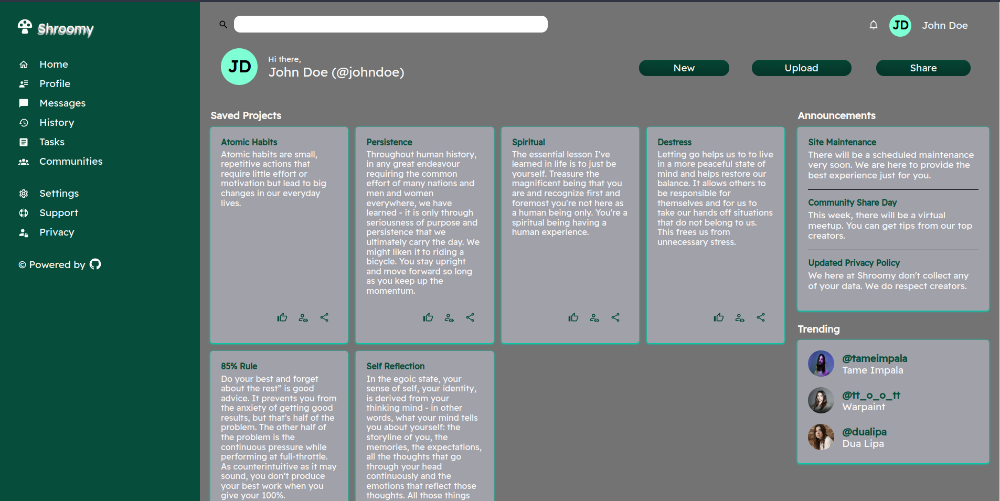
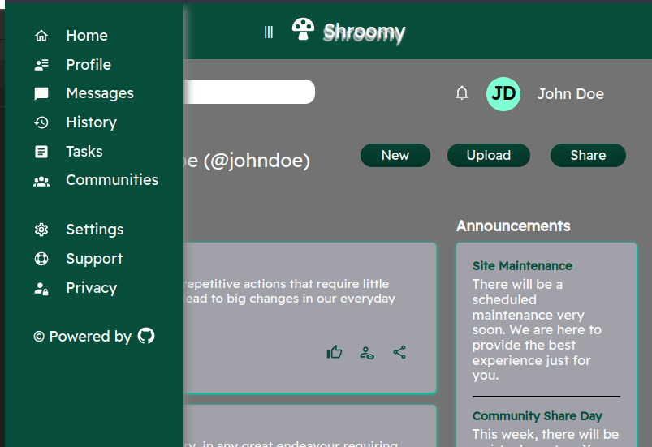

# Admin Dashboard
> The project is to create a well-constructed dashboard.
> Live demo [_here_](https://nabelk.github.io/admin-dashboard/).

## Table of Contents
* [General Info](#general-information)
* [Technologies Used](#technologies-used)
* [Features](#features)
* [Screenshots](#screenshots)
* [Room for Improvement](#room-for-improvement)
* [Contact](#contact)

## General Information
- The project is a part of The Odin Project: Full Stack JavaScript.
- The layout of dashboard is created by using CSS Grid. It makes visioning the layout to desired outcome a lot clearer.

## Technologies Used

### HTML

### CSS
    Normalize.css is being used in this project to override default browser style.
    
### Javascript & Vanilla JS
    A script written is for sidebar transistion and manipulate profile icon, name & username.
    

## Features
- Transistion sidebar when width of the page is compact.
- Responsive card elements.
- Responsive design (web, tablet & mobile).

## Screenshots

## Room for Improvement
- Position for header of #main-column for mobile view.

## Contact
Created by [@nabelk](https://www.linkedin.com/in/nabil-khalid-36791a241/) - feel free to contact me!